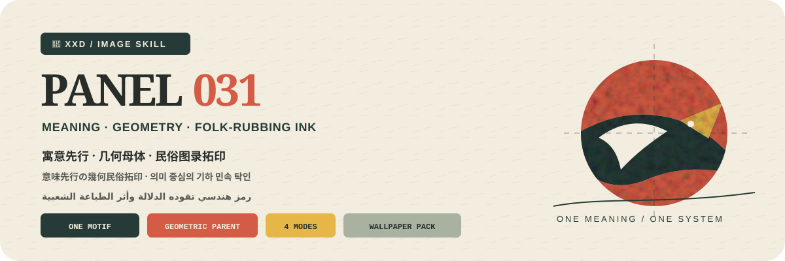

<p align="center">
  
</p>

<div align="center">

# 🦁 XXD Panel 031

### 写真を、意味先行の幾何学的な民俗拓印モチーフへ

[](./SKILL.md)
[](#4つの出力を支えるひとつの意味と幾何のシステム)
[](#境界と信頼性)

<a href="README.md">简体中文</a> · <a href="README.en.md">English</a> · <strong>日本語</strong> · <a href="README.ko.md">한국어</a> · <a href="README.ar.md">العربية</a>

</div>

> 一つの核心モチーフ · 元写真由来の幾何母体 · 民俗図録 · 内部の粗い印痕 · 外部の精密な秩序

XXD Panel 031 は、Codex と互換 Agent のための画像生成 Skill です。写真が裏付ける核心的な意味、文化的性格、感情関係を先に理解し、源写真を一つの主要モチーフと、物語上ほんとうに必要な少数の補助形へ削ぎ落とします。

主体自身から円、四角、三角、弧、軸、反復比率のいずれかを唯一の幾何母体として導き、モチーフ、文字、余白を整列、接線、共軸、入れ子、鏡像、比例進行、裁ち落としで結びます。明るい紙、一つの濃色骨格、一〜二色の元写真由来インク、精密な輪郭内部だけに残る木版拓印とドライスクリーンの荒れが、民俗図録、古物拓本、現代デザインを接続します。

## なぜ 031 が必要なのか

一般的な「伝統風グラフィック」は、ありきたりな吉祥記号、無作為な装飾、全要素の逐語変換、固定された赤黒生成りの衣装へ崩れがちです。

031 は順序を逆にします。

```text
主体らしさ／比率／身振り／関係を固定 → 一つの裏付けある意味を決める → 一つの核心モチーフと必要最小限の補助形だけを残す → 主体から唯一の幾何母体を導く → シルエット、負形、合体、拡大、入れ子、接線、共軸、鏡像、進行、裁ち落としを組織する → 明るい紙、一つの濃色、一〜二色の元写真インクを使う → 荒い印痕を精密な幾何の内部に置く → 文字も同じ構造に従わせる
```

無関係な写真に替えても、核心モチーフ、意味、幾何母体、シルエットと負形、インク階層、文字の整列がほぼ変わらないなら、それは 031 ではありません。

## 031 のビジュアル契約

- **元写真の主体らしさ：** 少なくとも三つの固有手掛かりで、比率、輪郭の流れ、姿勢、方向、動き、機能、関係を保ちます。
- **意味を先に置く：** 一つの裏付けあるテーマ、文化的性格、感情関係が残す要素を決め、写真の全要素を逐一変換しません。
- **一つの核心モチーフ：** シルエット、負形、局部拡大、形態合体、記号化で、識別性と内在する意味を同時に保ちます。
- **一つの幾何母体：** 主体由来の円、四角、三角、弧、軸、反復比率が、モチーフ、補助形、文字、余白を明確に統率します。
- **荒さは秩序の内部だけ：** 断墨、擦れ、紙の露出、濃度むら、ごく小さな版ずれは図形内部に置き、重要な輪郭と軸は精密に保ちます。
- **元写真由来のインク階層：** 明るい紙、一つの濃色骨格、一〜二色のテーマ色を面積、明度、重ね刷りで階層化します。
- **すべての形に役割：** 各要素に出典、意味、構造上の役割があり、一般的な伝統記号や装飾散点は削除します。
- **文字も幾何に従う：** 短い題名と必要な微注記を軸、接線、負形、境界に整列、入れ子、交差させます。

## 作例 · 近日追加

リポジトリには将来の作例用に [`assets/examples/`](assets/examples/) を用意しています。プロジェクト作者が確認した 031 の完成作品だけを追加し、それまでは別スタイルの投稿や画像を代用しません。

将来の作例は 031 の応用範囲を示すだけで、主体、余白比率、配色、文言、画角が生成参照や既定値になることはありません。

## 4つの出力を支えるひとつの意味と幾何のシステム

4つのモードは単独でも複数でも選択できます。`1`、`1+3`、`1、2、4`、`全部` と返信すると、Skill が重複を除き 1→4 の順で実行します。各モードは別々のタスクフォルダに独立出力され、一覧画像にはまとめません。`全部` は元写真1枚につき7点（通常3モード各1点＋壁紙4点）です。サイズはモード名付きで同時指定でき、未指定の通常モードは元画像に適応します。文案は既定で選択モード間に共通し、モード別指定も可能です。

| モード | サイズ方針 | 成果物 |
| --- | --- | --- |
| `top-bottom` | 元画像適応 | 上に完全な元写真、下に 031 の意味先行の幾何民俗拓印。両パネルは元画像サイズを保ち、厳密に 50/50 |
| `left-right` | 元画像適応 | 左に完全な元写真、右に 031 の意味先行の幾何民俗拓印。両パネルは元画像サイズを保ち、厳密に 50/50 |
| `design-only` | 元画像適応 | 元写真を見せず、変化デザインだけを表示。元画像の比率と寸法を維持 |
| `wallpaper-pack` | 端末別4サイズ | スマートフォン、iPad、デスクトップ、子ども用ウォッチの PNG を個別出力 |

優先順位は、正確な指定ピクセル > 指定比率／用途 > 通常モードの元画像適応です。原稿 `031.md` の 3:4 は初期の制作画角であり、現在の暗黙の既定値ではありません。

ペアモードの写真は、抑制した調色と必要最小限の環境拡張だけで忠実さを保ちます。デザイン単独と壁紙では写真を根拠として使いますが、原片は表示しません。

### 壁紙セット：連動または独立

壁紙に暗黙のサイズ既定値はありません。一般プリセットはスマートフォン `1440×3200`、iPad `2048×2732`、デスクトップ `3840×2160`、ウォッチ `1024×1024`。端末別のカスタムサイズも指定できます。

- **連動セット（推奨）：** まず iPad の基準作品を生成・承認し、残り3枚は元写真＋同じ基準作品を参照して各画面に再構成します。
- **独立4作品：** 各端末は元写真だけを参照し、モチーフ尺度、幾何裁ち落とし、負形、インク比率、拓印密度、文字整列をそれぞれ探れます。

連動は切り抜きではありません。4枚を個別に生成、構成、検査し、iPad→スマートフォン→デスクトップ→ウォッチの順に参照を連鎖させません。

## 文字も同じ幾何母体に属する

生成前に、自動文案、カスタム文案、文字なしを選びます。文字を入れる場合は対象言語または地域も指定します。

自動文案は、写真が裏付けるテーマ、意味、文化的性格、感情関係、象徴的な動きから短い題名を抽出します。対象文字体系で自然かつ明晰な編集書体に、ごく軽い図録印刷感を与え、軸、接線、負形、境界に合わせます。伝統の由来、慣用句、日付、番号、場所、来歴は創作しません。

既定はタイトル1本です。実際に情報価値がある場合だけ0〜2本の短い注記を追加し、洗練されて見せるためだけに番号、年、座標、アーカイブラベルを創作しません。

ユーザーが完成稿を渡した場合は一字一句保ちます。方向や編集可能な草稿の場合だけ、対象、目的、必須語、語調、含意を守りながら磨きます。

言語は命令文ではなく、想定する読者に従います。

```text
対象市場・読者 > 指定された成果物言語 > 方向指示の言語；不明なら生成前に確認
```

日本版は自然な現代日本語、韓国向けは自然な韓国語と正しい分かち書き、英国版は英国英語、アラビア語版は原則として自然な現代標準アラビア語と正しい右から左の組版を使います。外見、服装、風景、看板から国籍を推測せず、雰囲気づくりの偽外国語も使いません。

## 正確な幾何はコード、作品は画像生成

画像モデルが、意味を担う核心モチーフ、元写真由来の幾何母体、精密なシルエットと負形、明確な印色階層、図形内部の木版拓印とドライスクリーンの痕跡、明瞭な余白、対象言語の従属的な編集文字を作ります。`scripts/compose_panel.py` は画布計画、厳密な 50/50 ラスター合成、最終寸法、監査だけを担当し、プログラム描画で作品を偽装しません。

```bash
python3 scripts/compose_panel.py --plan --layout top-bottom --source photo.png
python3 scripts/compose_panel.py --plan --layout left-right --size 2560x1440
python3 scripts/compose_panel.py --audit result.png --layout design-only --size 2048x2048
```

正確な上下構成は総高さ、左右構成は総幅が偶数である必要があります。指定ピクセルは勝手に変更されません。

## 使い始める

```bash
git clone https://github.com/nevertoday/xxd-panel-031.git
mkdir -p ~/.codex/skills
ln -s "$(pwd)/xxd-panel-031" ~/.codex/skills/xxd-panel-031
```

Claude Code では同じフォルダを `~/.claude/skills/xxd-panel-031` にリンクできます。インストール後に Agent セッションを再起動してください。

```text
$xxd-panel-031
この写真を左右二連にしてください。文案は写真の意味から作り、自然な韓国語を使ってください。
```

写真だけでも呼び出せます。番号付きの複数行メニューでモードと文字設定を確認し、壁紙では連動／独立と端末サイズも確認します。

詳細仕様：

- [Skill ワークフロー](SKILL.md)
- [中国語の完全プロンプト](references/xxd-panel-031-prompt.zh-CN.md)
- [英語の完全プロンプト](references/xxd-panel-031-prompt.en.md)
- [元のスタイル指示](references/031-source.md)

## 境界と信頼性

- 各写真は独立したタスク内だけで使い、他の入力、旧成果物、作例の主題、色、文案、構図を借りません。
- 呼び出すたびに新しいタスクフォルダを作り、同じ原画像と条件でも新たに生成します。
- 成果物は PNG ビットマップであり、SVG、HTML、Canvas、プログラム描画の代替物ではありません。
- 設定済みビットマップブリッジは匿名化した状態だけを返し、プロバイダー、エンドポイント、ヘッダー、認証情報、プロンプト、応答本文を表示しません。
- 選択した通常モードごとに1点を返し、`wallpaper-pack` を選ぶと独立壁紙4点を追加します。`全部` は元写真1枚につき7点を4つの同階層モードフォルダへ出力し、一覧コラージュにはまとめません。

ローカル合成には Python 3 と Pillow が必要です。安全なビットマップブリッジは Python 3.11+ の `tomllib` を使用します。画像生成には、ホスト Agent の内蔵ラスター生成機能または設定済みの互換ルートが必要です。

## リポジトリ

```text
xxd-panel-031/
├── SKILL.md
├── README.md / README.en.md / README.ja.md / README.ko.md / README.ar.md
├── agents/openai.yaml
├── assets/banner.svg + examples/（今後のローカル作例用）
├── scripts/compose_panel.py + configured_imagegen.py
└── references/xxd-panel-031-prompt.zh-CN.md + xxd-panel-031-prompt.en.md + 031-source.md
```

## XXD について

XXD は小小東（Xiaoxiaodong）のブランド名の略称です。このプロジェクトは [@xiaoxiaodong01](https://x.com/xiaoxiaodong01) が制作・管理しています。

## サポートと会員制度

### 個別深度相談 · 1時間 CNY 299

Skills 利用に関する一対一相談は1時間 CNY 299です。下の WeChat QR コードから予約してください。

### Xiaoxiaodong Skills ユーザー交流グループ · CNY 99

一度 CNY 99 を支払うと、ワークフロー共有、作品相談、ユーザー同士の支援を行う交流グループに参加できます。時間制の個別相談は含まれません。

### 知識星球＋会員プロンプトライブラリ · 年額 CNY 699

[知識星球](https://wx.zsxq.com/group/15554814142882)と[XXD 会員プロンプトライブラリ](https://vip.xiaoxiaodong.ai/)は同じ会員権です。**一度の年額決済で両方を利用でき、二重の購入は不要です。**

1. 知識星球で加入後、WeChat でプロンプトライブラリの交換コードを受け取る。
2. プロンプトライブラリで加入後、WeChat で知識星球への招待を受け取る。

<p align="center">
  <a href="https://xiaoxiaodong.pages.dev/assets/wechat-qr.png"></a>
</p>

<div align="center">

**一つの意味ですべての形を統べ、粗い印痕は精密な秩序の内側にだけ生かす。**

</div>

---

<div align="center">
  <h2>☕ オープンソースプロジェクトを支援</h2>
  <p>このプロジェクトが時間の節約になったなら、Star、共有、コーヒー一杯で継続を支援できます。</p>
  <table><tr><td align="center" width="240">
    <a href="https://github.com/nevertoday/zhongguo-traditional-colors/blob/main/docs/images/buy-me-a-coffee-qr.png?raw=true"></a><br>
    <strong>Buy me a coffee</strong><br><sub>QR コードを読み取るか開いて支援できます</sub>
  </td></tr></table>
  <p><sub>支援は任意であり、このオープンソースプロジェクトの利用権には影響しません。</sub></p>
</div>
